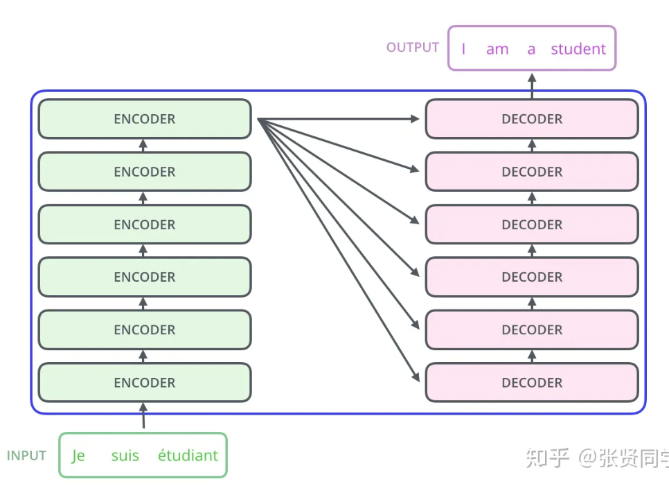
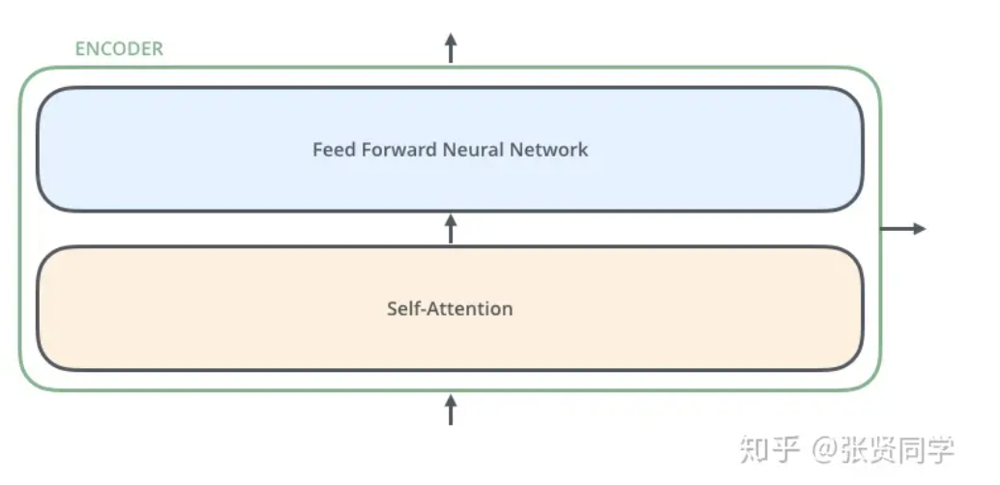

这里我们可以注意到 Transformer 的一个重要特性：每个位置的词向量经过编码器都有自己单独的路径。具体来说，在 self-attention 层中，这些路径之间是有依赖关系的；而在 Feed Forward （前馈神经网络）层中，这些路径之间是没有依赖关系的。因此这些词向量在经过 Feed Forward 层中可以并行计算（**这句话会造成困扰，我认为在 self-attention 层中，也能并行计算，没有必要单独说 Feed Forward 层也可以并行计算**）

## **Self-Attention 整体理解**

别被“Self-Attention”这么高大上的词给唬住了，乍一听好像每个人都应该对这个词熟悉一样。但我在读论文**[Attention is All You Need](https://zhuanlan.zhihu.com/p/196642078/https%3A//arxiv.org/abs/1706.03762)** 之前就没有听过这个词。下面来分析 Self-Attention 的具体机制。

假设我们想要翻译的句子是：

