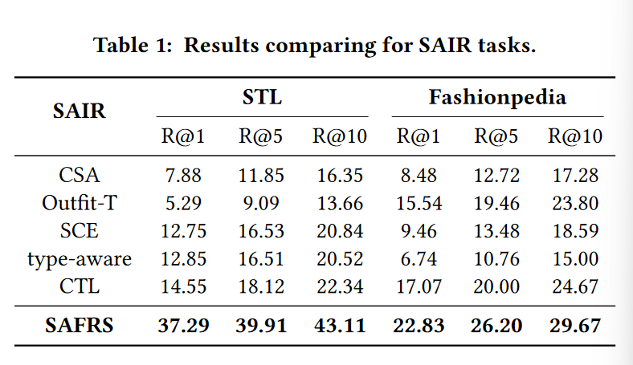

Fashion Outit Recommation (FOR) 通常是指向彼此匹配良好的用户推荐一组时尚项目，这依赖于有效的 outit 兼容性建模。

不合适，因为数据集中的服装应该是无序列的。

目前比较好的是用**Graph Modeling**的方法来进行建模，因为提供了一种更复杂的方法来探索项目之间密集和复杂性关系。

其次比较好的势注意力机制建模。

通过掩码项预测任务来学习outfile compatibility。

例子：2022年，Rohan Sarkar, Navaneeth Bodla, Mariya I. Vasileva, Yen-Liang Lin, Anurag Beniwal, Alan Lu, and Gerard Medioni. 2022. OutitTransformer: Outit Representations for Fashion Recommendation. In CVPR Workshops. 2262ś2266.等人提出了基于Transformer的方法。

用作了baseline

Show me the best outfit:

其中，outfil-T：2023

outfitTransformer:

Bi-LSTM:2017

GCN:2019

SiameseNet:2017

Type-aware:2018

SCE-Net:2019

CSA-Net:2020

数据集：Polyvore Outfits dataset

**Dual Preference Percep:**

AFFIG:Modeling field-level factor interactions for fashion recommendation

mm 2022

Hierarchical fashion graph network for personalized outfit recommendation

SIGIR 2020

