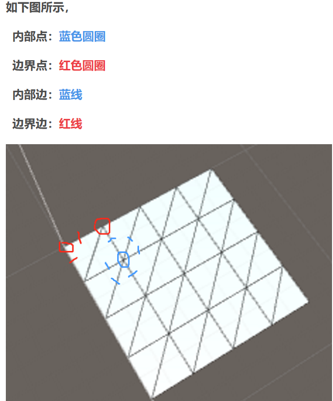
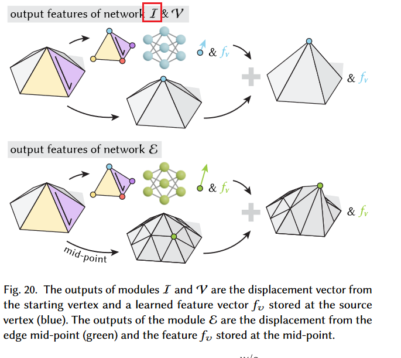

# 神经细分

## 网格细分

用于3D建模主要目的是使得面之间的连接更加平滑。如下图：

可以看到，前后棱角分明的图形变成了圆，硬边变成了软边，法线也被平滑。

### 作用

细分是一种增加面的方法，来使得变化更加平滑。

网格的分辨率过低，细节不够丰富，纹理贴图由于三角面片过大，纹理坐标距离过大，采集的纹理坐标数量不够，在着色阶段由于线性插值引起模糊，此时需要用网格细分增加分辨率，贴图会更加细腻逼真，越是高级特效，网格就需要更细化

1. 简单的细分：（中点细分）

这种方法的最大问题：相邻三角形之间的过度不光滑，并且对于边界位置，无论细分多少次都还是边界。

2. loop细分

loop细分则在简单的中点细分的基础上，添加了光滑过度的因子，即在每个顶点处添加一个权重约束，让相邻三角面片之间有连续的效果，本质上是连续模型的线性插值效果。

## loop 细分

loop细分在简单细分（中点细分）的基础上，增加了光滑过度的因子，即在每个顶点添加一个权重约束，让相邻三角面片之间有连续性效果。

我们先理清一些概念：

具体方法如下：

每次迭代：

1. 在每条边上增加新的顶点
2. 更新旧顶点的位置，新位置与其邻接的所有（非新增顶点）有关。

然后将顶点和边分为两类：内部与边界：

一个边最多被两个三角形公用，如果被一个三角形用，就位边界，如果被两个三角形公用，就位内部边。

组成边界边的两个顶点为边界点，内部边的两个顶点为内部点。

1. 增加顶点：

（1）内部边：

则新顶点：$v=\frac{3}{8}\times(v_0+v_1)+\frac{1}{8}\times(v_2+v_3)$ 

为什么是这么奇怪的系数？

有个推导，咱们不看了。

（2）边界边：

新顶点位置：$v=\frac{1}{2}\times(v_0+v_1)$

2. 更新旧顶点的位置

老三角形的顶点：A，B，C，D

以A点为例，我们求A更新后的点A'的位置：

A的相邻顶点有3个，因此A的度为：n=3

然后我们可以得到一个加权系数u：

然后求A的临点之和s：

s = B + C + D

然后我们求A'

该论文介绍了一种基于神经网络的数据驱动细分算法。

观察图，比较经典的中点细分（不够光滑）和Loop细分（部分过于光滑，未能很好地保留原始性质）都存在一定缺陷。本文提出的神经细分（Neural Subdivision）算法，通过学习输入模型的相关性质，来生成希望的细分结果。

这是一种自监督训练设置：

**输入**：高分辨率网格。**对于任何训练形状，我们随机生成粗对应物的各种低分辨率离散化，同时维持双射映射，该映射规定了细分过程中每个新顶点的确切目标位置**

**训练过程**：我们针对所有局部网格补丁的同一组网络权重进行优化，从而提供不受特定输入网格、固定属或类别限制的架构。我们的网络以旋转和平移不变的方式对局部框架中的面片几何进行编码。

# introduction

**Subdivision surfaces**：细分曲面：通过离散曲面网格的确定型递归上采样来定义。

经典工作：

​	Step1：通过分割和添加顶点，将每个输入网格元素分割为许多元素：如一个三角形变为3个。

​	Step2：根据纯粹基于局部网格连通性的加权方案，通过对其邻居位置进行加权来平滑网格顶点的位置。

现有方法的不足：在自动对低分辨率资源进行采样时：如果没有用户的指导，经典方法会使整个形状过于平滑（见图 1）。

**原因：**无法利用表面局部斑块的几何背景

## **作者的方法：Neural Subdivision**

**传统的网格细分技术：**如Loop划分

细分过程中涉及应用固定的拓扑规则来优化网格，通常通过对顶点位置进行线性平均来完成。

> Loop 划分
>
> 1. **增加细节：Loop Subdivision 将每个三角形细分为多个更小的三角形，通过计算相邻顶点的线性平均来确定新顶点的位置。**这可以增加网格的细节级别，使曲面看起来更加光滑和细致，从而提高视觉效果。
> 2. 拓扑保持：Loop Subdivision 是一种拓扑保持的细分方法，它确保了网格的拓扑结构不会被破坏。这意味着细分后的网格仍然是一个合法的三角形网格，没有奇异性或非法拓扑结构，这对于许多计算机图形应用是重要的。
> 3. 简化表示：尽管 Loop Subdivision 增加了细节级别，但在细分过程中，它仍然可以减少原始网格的复杂性，因为它将一个大的三角形分成多个小的子三角形，这有助于降低计算和渲染的复杂度。
> 4. 连续性：由于采用线性平均，Loop Subdivision 保持了细分后网格上的连续性，这意味着曲面在细分后仍然具有平滑的特性，避免了锯齿状的边缘。

在神经细分中，作者提出了一种不同的方法。他们仍然使用与经典方法（如Loop细分）相同的拓扑规则，但引入了神经网络进程。这个神经网络考虑了网格的局部几何特性，并使用这些特性来在细分过程中调整顶点位置。换句话说，神经网络根据其操作的局部网格区域的具体特征来条件化顶点位置的更新。

然后，作者使用一组示例几何数据集来训练这个神经网络。训练过程允许网络学习如何执行依赖于几何特性的非线性网格细分。与经典方法依赖简单的线性平均不同，神经细分中的神经网络引入了更复杂和具有几何感知的顶点位置更新。

### 挑战

大多数模型并不是采用细分建模工具创建的，因此没有用于监督式训练的成对数据——高分辨率网格和对应的低分辨率网格的数据对。

因此作者提出了一种自监督的方法：

在训练时仅给出任意来源/连接的高分辨率表面网格。我们随机生成训练样本的候选低分辨率版本，同时保持其表面之间的双射对应关系。

> 指的是两个不同分辨率的网格，其中每个点或面在两个网格之间具有一对一的映射关系，这个映射是双射的，也就是说，每个点或面在两个网格之间都有唯一的对应点或面。
>
> 也就是低分辨率网格中的每个新点都与高分辨率网格中的**某点**存在一一对应的关系，反之不一定

如下图：

在人马图像上进行训练，然后在猩猩图像上进行评估。

作者提出的方法的优点：

该方法的输出是一个曲面网格，其连接方式是确定性的，基于输入数据确定，这使得生成的曲面网格可以直接在标准图形管线中使用，如纹理映射。这意味着生成的网格可以轻松地与其他图形处理步骤集成，而无需进一步的处理。如下图：

> 纹理映射：
>
> 是计算机图形学中一种常用的技术，用于在三维图形模型的表面上添加细节、颜色、图案或纹理。它的基本思想是将一个二维图像（纹理）映射到三维模型的表面，以模拟真实世界中的材质和细节。

1. 与现有的曲面生成模型不同：该方法的输出是一个曲面网格，其连接方式是确定性的，基于输入数据确定，这使得生成的曲面网格可以直接在标准图形管线中使用，如纹理映射。这意味着生成的网格可以轻松地与其他图形处理步骤集成，而无需进一步的处理。
2. 基于局部邻域的学习：通过共享权重并跨所有训练网格的所有局部区域进行训练，该方法学习了一种基于局部邻域的规则，而不是基于整个形状的规则。相对于现有方法，这使得神经网络不再受到拓扑限制，不需要依赖模板，也不需要在训练期间使用大量非常不同的形状。
3. 泛化性能：作者表明，即使在单个形状上进行训练，他们的方法也能够泛化到新的网格，这意味着该方法可以适用于多种不同的形状和应用。
4. 自动编码顶点位置数据：作者设计了他们的神经网络，以在本地坐标系中编码顶点位置数据，从而实现了旋转和平移不变性，而无需手工预定义的特征描述符。
5. 实验效果：作者通过一系列定性和定量实验展示了他们方法的有效性。他们的方法生成的细分网格与真实的高分辨率形状更接近，甚至在使用少量非常不同的示例进行训练时也胜过传统的插值和非插值细分方法。作者还引入了一个定量基准测试，并在测量上采样保真度时展示了与经典细分方法相比的显著增益。
6. 应用领域：最后，作者还展示了神经细分的典型应用，包括低多边形网格的上采样和3D建模。这些应用说明了该方法在实际问题中的潜在用途。

经典的线性细分方法是通过组合更新（分割面、添加顶点和/或翻转边缘 [Kobbelt 2000]）和基于相邻顶点位置的局部平均的顶点平滑（重新定位步骤）来定义的。

方法的特点：

数据驱动：

`我们的细分是数据驱动的。对一组机械物体（左，绿色）或一组光滑的有机物体（右，绿色）进行训练会产生截然不同的风格（蓝色）。`

# 3 神经细分

## Inference

`神经细分采用粗三角网格（灰色）作为输入，并输出一系列具有不同细节级别的细分网格（蓝色）。在训练期间，我们最小化从地面实况（绿色）到各个级别的输出网格（蓝色）的 l2 损失。我们的训练数据由粗网格和细网格对组成（左上），每对之间有一个双射映射 f。`

该方法通过将每个三角形细分来创建额外的顶点和面，来提高图形的分辨率。输出则是一系列不同细节级别的细分网格（上图中的蓝色部分），细分过程则遵循简单的拓扑更新规则：在所有边的中点插入新的顶点，然后使用神经网络在每个新的细分级别上预测所有顶点的新位置。

## 训练和损失函数

使用生成的数据作为训练数据。

用简单的L2范数来衡量损失，通过测量在每个细分级别上每个预测顶点位置与原始形状上对应点（绿色）之间的距离来训练他们的神经网络。

## 数据生成

作者指出每个由细分步骤创建的顶点v都有一个明确定义的映射回粗糙网格，该映射将该顶点映射到其相应的中点。因此，对于任何细分级别的细分网格，都可以通过一系列中点到顶点或顶点到顶点的映射将其映射回初始的粗糙网格。在实际应用中，他们使用重心坐标来编码这种细分到粗糙的一对一映射，$g$。因此，如果存在一个粗糙网格和原始网格之间的一对一映射$f$，那么我们可以通过组合这两个映射来定义与顶点v对应的原始网格上的唯一点：$f(g(v))$。

## 网络架构 Network architecture

神经网络中有可进行学习的模块，这些模块是被神经网络**递归**调用的：

在原子局部网络的**邻域**上运行，并预测微分特征，（可学习模块表示网格局部坐标中的几何图形而不是世界坐标的），然后使用这些特征来计算新细分级别的顶点坐标。

具体而言：

- 初始步骤：首先计算基于局部坐标系的微分顶点量
- 然后将一个可学习模块1应用于每个顶点的1-环邻域
- 最后将这些微分数量映射到存储在顶点处的高位特征向量中。

> **1-环邻域**
>
> 1-环邻域指的是一个几何结构中的顶点及其直接相邻的顶点集合。对于一个给定的顶点，其1-环邻域包括了与该顶点直接相连的其他顶点，也就是与之共享边的顶点。

#### 对于每个细分迭代

假设拓扑结构遵循loop细分方案：将每条边添加中点，从而将一个三角形变为4个：

具体而言：

1. 顶点步骤：使用模块$\nu$ 根据顶点的1-环邻域预测下一级细分的顶点特征。
2. 边步骤：使用模块$\epsilon$来计算在中间添加的顶点的特征，这些特征基于前一个网格层级上由边链接的顶点对。

#### 对半翻边（half-flap）的操作

half-flap指：一个有向边和其两个相邻的三角形

作者使用这个有向边来定义局部坐标系，用于估计可学习模块的输入或输出的微分特征。

同时，有向边也允许按照规范化的方式对half-flap的四个相邻顶点进行排序，将它们的特征链接起来，输入MLP进行处理。

MLP的权重在每个模块类型内部以及在所有细分级别之间是共享的。

模块$I$ 和 $V$,  处理由边定义的所有half-flap， 并使用平均池化操作将half-flap的特征合并为每个顶点的特征。

模块$\epsilon$ 通过平均池化操作将来自两个half-flap的特征进行合并。

这个架构是局部的。

# 4 数据生成和训练

神经网络细分有两个关键：

1.  网络架构不变层。
2. 训练过程、数据和损失函数

## 关于损失函数的选择：

1. 通过减少算法生成粗/细网格对：选择chamfer distance（点集之间的误差）和基于形状对应的的l2范数训练出的模型如下：

red：采用chamfer loss训练得到的：这种训练方式得到的模型未能捕捉表面拓扑结构

蓝色：使用我们的l2范数的形式，可以得到更好的结果。

2. 通过测量网络预测的细分与实际结果之间的距离（例如，预测点与其在实际网格上的投影之间的平均距离）：如果选择“最近点”作为我们的衡量标准，那么由于他们会导致非双射映射，因此导致损失函数无法捕获整个网格地面的实况网络。

而我们的方法（self-parameterization）则确保了双射性，因此可以成功捕获整个实际地面真是表面：

### self-parameterization 方法

一个两步模块，可以应用于任何选择的边坍缩算法（参见图11），并且在减少过程后将输出一个双射映射。因此，连续自参数化的输入是一个三角形网格和一个选择的边坍缩算法，输出是一个经过减少并具有相应双射映射的网格模型。

输入：三角形网格：$M^L = (V^L, F^L)$ ，where$V^L$ 和$M^L$分别为原始的点、面信息。

然后把他们逐步转化为一系列网格：$M^l = (V^l, F^l)$ ，where $0 <= l <= L$ ，$M^0$是最粗糙的网格。

每个边，从$M^l$坍塌到$M^{(l-1)}$ ，我们均即时计算这个过程中的双射映射：$f^{l-1}_l:M^{l-1}\rightarrow M^l$ 。最终的映射方式：
$$
f^0_L:M^0\rightarrow M^L\\
f_L^0 = f_L^{L-1}·\dots f^0_1
$$
现在我们将重点放在**单个边坍缩**的双射映射计算上。

### 单个边坍塌：

在每次坍塌中，除了坍塌边的邻域外，其余部分三角剖分（就是将一个图形分成多个三角形的过程）保持不变。

设：$N(i)$ 为顶点$i$的相邻顶点的集合，$N(j,k) = N(j)\cup N(k) $， 表示边$(j,k)$的相邻顶点的集合。当每次坍塌后，算法会以两个阶段计算边的1-环：$N(j,k)$的双射映射：

首先，算法将坍塌前的邻域$N(j,k)$参数化到二维空间中。

然后算法在三维网络和**UV空间** 中执行边坍缩。

具体过程示意图见下图：13

> UV映射是一种将二维图像坐标（通常称为UV坐标）与三维模型表面上的点相对应的技术。允许将图像或纹理精确地贴合到三维模型的表面上，使模型具有更加逼真的外观，增加了视觉细节和真实感

在坍缩之前，$N(j, k)$的边界顶点在坍缩后成为$N(i)$的边界顶点。因此，UV参数化在坍缩后仍然有效且保持单射性。

对于任意一点$p^{l-1} \in M^{l-1}$，位置变化如图14：注意，这里点的绝对坐标不变，也就是UV坐标的共享性。

特别注意，我们使用共形展开来计算1-环的UV参数化，在每次坍缩一个边后并插入一个新顶点后，我们均通过进行一次代用固定边界的共形展开来确定这个顶点的UV位置。

> 共形参数化是指将一个表面或区域映射到平面或二维空间时，保持局部角度不变的映射。

损失函数中强调了重心的概念：

该方法保证了在边塌陷过程中，每个三角形的重心位置尽量不发生改变，进而保证了模型的基本形状。

## 训练数据和损失函数的计算

我们的训练数据是通过在随机边坍缩上应用连续自参数化来构建的。在图8中，给定一个高分辨率的形状（绿色），我们使用 qslim [Garland and Heckbert 1997] 结合随机序列的边坍缩来构建多个不同的减少模型（灰色）。在坍缩过程中，我们嵌入自参数化来为每个粗细对构建高质量的双射映射。

**损失的计算**

在网络对粗网格进行细分后，我们使用映射来检索与输入形状的一对一对应关系。具体来说，在检索对应关系时，我们使用Loop拓扑更新，在每条边的中间添加点，**例如在粗网格三角形中具有重心坐标（0.5, 0.5, 0）的点。我们使用粗网格上的这些重心坐标 b 来获得细网格上的重心坐标 f (b)，**如图14中使用双射映射 f 所示。在训练过程中，假设$\epsilon (b)$ 是网络$\epsilon$ 输出的顶点位置，我们用l2范数：$||f(b) - \epsilon (b)||$ 来衡量每个顶点的损失。

# 5 网络架构

输入：给定先前细分级别的网格以及已知的拓扑更新规则（如Loop中的中点细分）

输出：所有细分网格的顶点坐标。

具体而言，计算过程分为三个阶段(初始化阶段，顶点阶段，边阶段）：（如图18所示），这三个阶段分别对应三个模型：$I$，$V$，$\epsilon$

1. 初始阶段：可学习的神经模块$I$，将输入的每个顶点特征映射到其对应的高维特征向量。
2. 顶点步骤：在每个细分迭代中，顶点步骤使用可学习的模块$V$来更新输入的网格三角形点的特征。
3. 边步骤：使用可学习的模块$\epsilon $ 来计算在输入网格边中点生成的顶点特征。

总过程：在初始化和顶点步骤中，我们分别对一个顶点的所有出边的半翻边应用 V 和 E，并使用平均池化将输出特征组合回中心顶点（蓝色）。在边步骤中，我们对无向边的两个半翻边应用 E，并使用平均池化将输出特征映射到边的中心顶点（绿色）。

**特别的**

我们做出了几个关键的设计选择，对于我们的网络能够在非常少量的训练数据中实现良好泛化至关重要:

1. **局部网格操作与共享权重**：
   - 尽管所有的网格更新步骤都是全局性的（即影响网格的每个顶点），我们的学习模块却在局部网格补丁上操作，并共享权重。这意味着即使只有一个训练对，也能提供许多局部网格补丁来训练我们的神经模块。
2. **基于原始离散网格元素**：
   - 我们的模块针对网格的原始离散元素进行操作，无需对表面进行重新参数化或重新采样。这种离散化表示允许我们保留输入的拓扑结构，并在不同拓扑的新型网格上实现泛化。
3. **相对局部坐标系的微分量**：
   - 我们使用相对于局部坐标系的微分量来表示顶点，而不是使用全局坐标。这意味着我们的神经模块在不受刚性运动影响的表示上进行操作，从而简化了训练流程并提高了泛化能力。

我们接受的输入是half-flap的形式，我们选择使用half-flap，是因为它为相邻面的四个顶点提供了唯一的规范方向，同时，它还提供了一个明确定义的局部坐标系，我们用它来定义输入和输出的微分顶点量。

每个flap operator是一个MLP，定义在四个有序点的特征上，我们在所有细分级别和训练示例中针对每个模块 (I, V, E) 训练一个操作器。

之后，我们使用平均池化在所有神经细分步骤中将不同的half-flap特征聚合到每个顶点特征，具体入下：

1. 在初始化步骤和顶点步骤中：half-flap operator应用于顶点的1-环邻域中的每条出边，然后平均池化操作将每个half-flap的输出聚合成每个顶点的特征
2. 边步骤中：只考虑细分边的两个端点的每个顶点特征，用于计算插入顶点的特征。

## 输入输出表示

 ### Network $I$

**输入：** 每个半翻边的输入特征包括：三个边向量，和每个顶点的微分坐标。

> 因为一个半翻边包括：一个有向边和它的两个相邻三角形，因此用三个变向量和4个顶点的微分坐标来描述半翻边
>
> 
>
> **微分坐标**向量存储了离散曲率信息，被定义为顶点的绝对坐标与其网格中相邻顶点坐标平均值的差异

为了实现旋转不变性，我们将微分量表示在每个半翻边的局部坐标系中（见插图），其中将半边方向视为x轴，通过对两个相邻面法线求平均得到的边法线作为z轴，而前两个轴的叉积成为y轴。

输出：使用局部半翻边坐标系中来自中点细分网格的顶点位移向量（见图20）。对于初始化和顶点网络，预测的位移在顶点上

### 顶点和边步骤：Network $V和\epsilon $ 

输入：

我们此处使用的半翻边与上个网络类似，但我们使用边向量和每个顶点的高维学习特征（由初始化步骤或前一个细分迭代产生）

输出：

使用的半翻边的输出包括高维学习特征和微分量，可用于重构顶点位置。

对于边网络，预测的位移在边的中点上。在我们的实验中，我们注意到从中点细分表面或其他细分表面预测没有区

我们在每个步骤后估算顶点的全局坐标以可视化中间细分级别并计算损失函数，并在每个步骤之前将全局坐标转换为局部微分顶点量，以确保每个网络只观察到平移和旋转不变的表示。

# 6 Evaluation

