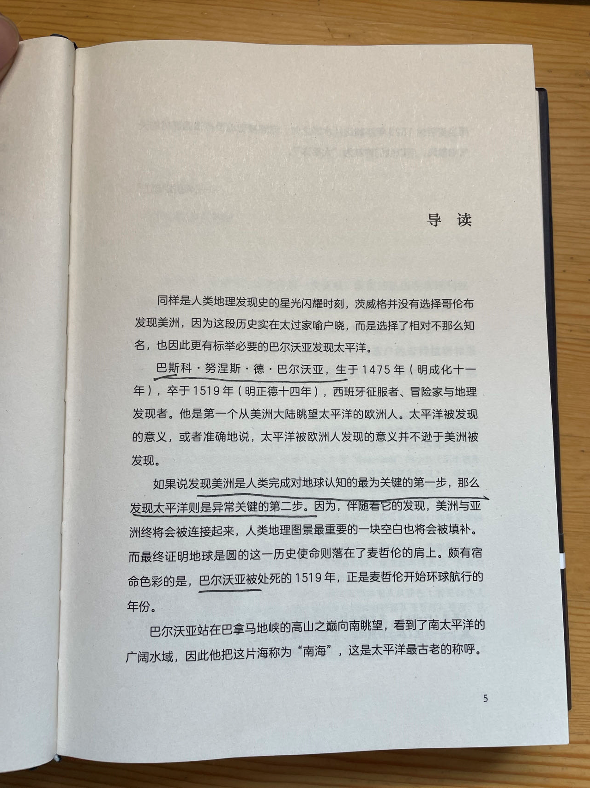

《人类群星闪耀时》，开始于23年8月25日

# 1： 不朽的逃亡者——巴尔沃亚
1475-1519

1513年，西班牙探险家巴尔沃亚首次发现太平洋。

> 巴尔沃亚被处死的1519年，正是麦哲伦开始环球航行的年份

太平洋最古老的称呼：南海。

> 当时的人们对哥伦布天才的想象力还缺乏足够的了解，所以丝毫未怀疑哥伦布的种种誓言。

> 好一伙乌合之众，他们孤注一掷，期待一夜暴富。为达目的，不管怎样的暴力和罪行，他们都无所顾忌。哥伦布的虚妄之说在他们中间交口相传，让他们想入非非...