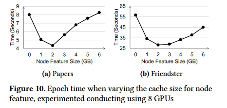

又要读论文啦！！

**目的**：联合利用多个GPU来训练图神经网络。

**方式**：用一种特殊的数据布局来利用GPU之间的`NVLink`连接， 并且GPU（显存）中存放了图形拓扑和popular node features。

**措施**：

- 引入集体采样源语：collective sampling primitive
- 设计了基于消费者生产者的管道：允许不同小批量任务并行。

##  先抨击了已有的系统：`Quiver`和`DGL-UVA`

系统`Quiver`与`DGL-UVA` ：将图形拓扑存放在内存中，而节点特征存放在GPU的显存中，每个GPU独立进行图采样，并使用UVA（统一虚拟寻址）通过PCle（一种高速串行计算机扩展总线标准，支持显卡）访问图拓扑，但有两个问题：

1. 高沟通成本：

图1和表1说明：

- UVA等系统读入了太多无用的数据量
- 采用的PCIe接口远远慢于NVLink，但UVA与Quiver对NVLink的支持并不好，UVA采样是在PCIe上的

2. GPU利用率低

图为“更改物理线程时候Quiver的图形采样和功能加载的执行速度”，且这个GPU最多开5120个线程。

图中可以发现，均存在某个点，在那个点之后，就算再开线程，但速度就不变了基本。因此无法充分利用GPU。

## 提出自己的模型

DSP：

- 将图结构划分为不同的图块，这些图块都是联通（well-connected）的，并把每个图块放在一个GPU中，这样图形采样就能通过NVLink，而不是用PCIe了，而且由于不用PCIe了，所以读取的数据量就变少了。

  >  为什么呢？因为看前面，前两个系统把图结构存放在内存中，而NVLink是适用于GPU之间通信的，因此采样需要通过PCIe，但如果把图信息放到GPU中，那采样就是读取GPU，就可以通过NVLink了。

  每个GPU的剩余显存，则用来存放不同的节电功能，之后，所有的GPU形成一个通过NVLink的大型聚合缓存，来减少节点通过PCIe对CPU内存的访问。

- 定义了采样器，装载器和训练器：

  - 采样器：就是采样——集体采样源语：CSP
  - 装载器：加载图样本的节点特征
  - 训练器：用来训练

- CSP（集体采样源语：将每个图节点上的采样任务推送到其驻留的GPU上，而不是拉出其邻接列表（图1）大幅度减少通信数据量：因为通常只对节点邻居节点进行采样。

- 利用生产者消费者管道，来重叠"使用GPU"的任务

## 基于采样的GNN训练

基于文中的假设，太长了不写了，直接复制~~，狠狠地复制~~！

**不基于采样的GNN训练**

然后我们知道GNN的聚合公式：

不知道？不知道~~滚~~回去看文章中的解释。

有个关键点就是：

用第一层训练节点$v$ 的时候，要聚合$v$的邻居节点的信息，同时其邻居节点也聚合了他们自己邻居节点的信息，因此当在第二层训练节点$v$时，表面上节点$v$是再次聚合了它邻居节点的信息，实则同时聚合了邻居节点以及邻居节点的邻居节点的信息。故，GNN有k层，训练一个节点$v$就需要聚合其k-邻居节点的信息，并且貌似重复聚合了很多次。所以在稠密图中复杂度贼高。

**基于采样的GNN训练**

训练是在小批量中进行的，并且在每个小批量中，使用某些节点（称为批量的种子节点）而不是图中的所有节点的输出嵌入来计算梯度。此外，在计算种子节点$ v $的输出嵌入时，不是使用$ v $的所有 K 跳邻居，而是从 v 的 K 跳邻居中采样子图（称为图样本）以降低复杂性。(不用全部的邻居了，而是只挑一部分）

例子：

此处有个“fan-out”向量。[2,2]:

对于节点采样：每层，每个节点选择两个邻居。

对于分层采样，扇出向量指明了该层中的所有种子节点采用的邻居总数。

**节点特征**

节点向量通常具有高纬度，并且可能GPU显存没法存下整个图，因此需要存到内存中，这就需要用PCIe了，但作者观察到：在训练GNN的时候，某些节点的访问频率比其他节点高很多，因此把这些节点存放在GPU的显存中，这样之后进行特征采样时候，就能用NVLink了。

## DSP架构

### 数据布局

每个GPU都存了一个图划分，包含一些节点和邻接表。（METIS方法）

怎么划分？用到了一种能够最小化不同划分之间边缘交叉边数量的划分方式，来尽量减少跨GPU的通信。

对于每个图划分中的热门节点，尽可能多地存在GPU中，其余节点就放在CPU中。

为什么能把图拓扑存在显存中呢？因为即使对于特大型的图，如超过10亿条边的图，也只需要大约8G的显存，况且还可以只存热节点。

除此之外，该模型还采用了分区特征缓存，也就是把相似的节点，就算不在同一个子图中，也存在有空位的多余的GPU的显存中，之后提取图特征的时候，还是只用访问显存以及GPU之间的通信，而不用通过内存。

### 训练过程

如图4，每个GPU中有3个东西：

**Sampler采样器**

每个GPU上的采样器通过与其他GPU上的采样器合作，来构造出图样本，并且当采样器需要访问其他GPU上的图拓扑时，不是直接把整个图拉过来，而是通过另外的采样器实现。

采样器构造如图b：

**Loader装载器**

就是获取采样器采集到的描述图样本的节点的特征向量，热门节点直接在显存中获得，冷门节点则在内存中获得，两者并行，因为一个用NVLink，一个用PCIe

**trainer训练器**

每个训练器都有模型参数的副本，就是用loader给过来的特征向量进行训练，分别计算最终的输出以及梯度，然后部署在不同GPU上的trainer，用collective allerduce聚合梯度。

**同一批量的三个er，顺序执行**

对于不同批量，作者设计了前文提到“生产者消费者管道”来并行利用GPU资源。

***注意***

>当只有一个GPU时候，Sampler和Loader就变成本地服务了，不再需要从其他GPU上采集交换信息。

> DSP可在多机多GPU上运行，此时DSP会将图的拓扑结构和热节点复制到每个机器中，然后不同的机器存储不同的冷节点，机器之间仅需要传送关于冷节点的知识，同一个机器内部将图进程划分，存在不同的GPU上

## CSP:集体采样原语

主要用于GPU之间的通信。

### 工作流程

CSP可用Node-wise和layer-wise，但我们假设CSP采用Node-wise的方法逐层采样：以图3（b）为例

在具体采样过程中，对于每一层，CSP由**所有**GPU上的采样器共同来执行完采样工作，且采样工作分三个阶段完成：shuffle，sample，reshuffle。

例图：

    
    

有2个GPU，4个seed node(作为训练样本的节点)

- 在shuffle阶段：利用GPU之间的通信，将每个seed node交给存有其临街列表的GPU，如$E$与$B$换位置了（数据推送）

- 在sample阶段：每个GPU在本地存放的邻接表中找出自己有的seed node的所有邻居节点，并进行采样（挑出来几个，如$A$挑选出了$C$与$E$）
- 在reshuffle阶段：把shuffle阶段换走的seed node换回来，同时连带着其在sample阶段采样的节点一起回来。

> 采样的每个阶段，都设置了同步操作来保证各个GPU的进度一致。

### CSP长什么样子

#### 参数

采样方式：

- 有偏采样：按照每个节点权重占比作为其被选择的概率，权重放到边上。
- 无偏采样：大家概率一样

我们发现，由于在$shuffle$阶段，每个seed node都被换到了存有其邻接表的GPU中，因此无论有偏采样还是无偏采样均可以通过只访问GPU实现。

$frontier~node$： 其邻居将被采样的节点。

由于DSP与CSP支持两种主流的图采样：node-wise和layer-wise，因此，以下分别介绍这两种：

在$node-wise$中，fan-out向量直接指出了每层中每个$frontier~node$采样的邻居节点的数量；

在$layer-wise$中，fan-out向量只能确定每层中所有$frontier~node$总共采样的邻居节点的数量，具体确定每个$frontier~node$采样的邻居数量的方式，也是按照其邻居的总权重占所有$frontier~node$ 的邻居的总权重的占比确定的。

 ## 消费者生产者管道

同一小批量数据在GPU中必须要依次走过采样器，装载器和训练器，必须同步执行。但不同的小批量数据无所谓，同时，由于同步问题，且有些数据利于计算，有些不利于，但每个阶段所有GPU必须同步执行，因此就会造成GPU的闲置，于是就设计了这种管道重叠执行不同的小批量任务。

如图：

------

在这里再理一下DSP模型：每个GPU内部，用三个东西：Sampler，Loader和Trainer，这三个东西在行动时候，需要占用特定的SM，但这些SM可能会重叠。对于同一个小批量任务，必须按照Sampler，Loader以及Trainer的顺序执行，但是可以在GPU1上的Sampler执行，然后到GPU2上执行Loader，最后在GPU3上执行Trainer。但每个GPU执行Sampler Loader以及Trainer时候，都会需要其他某些GPU参与，且要求也调用与之相同的东西。

其结构是这样的：，然后，每个GPU只存部分图节点和其邻接表。但每个GPU

不定地被分到哪一个小批量数据的训练任务。当其被分到一个小批量任务时候，他拿到seed nodes，作为此时的frontier node，进入Sampler进行采

样。采样过程细化为这个图：， 采样时候由CSP原语控制，由于某个GPU的

任务可能会涉及到一些他没存储的节点（如GPU1中的E节点），那么他需要借助其他GPU的采用器，同时调用GPU们的通信内核，shuffle这些seed node。采样的每个小阶段，都需要不同GPU之间的配合，主要调用GPU的通信内核，但负荷很轻（只需要少部分的内核参与即可），且只需要少量的带宽就可以完成通信，多余的带宽可以让其他通信内核使用。采样完毕后，该GPU的才能执行loader和trainer，因此采样时候该GPU的部分计算内核就被空闲了，所以它在采样时候可以同时运行多个计算任务。这时候，这些其他的loader和trainer任务从哪里来，就用到了管道。**loader和trainer过程也需要用到通信内核与其他GPU进行交互。**

**这里可以看出管道的一个用处，就是把同一个批量的训练任务的三个阶段：Sampler，loader，trainer分开了，尽管是同步执行的，但不再是必须在同一个GPU上执行**

------

**结果：**

DSP-Seq为顺序执行，没有管道，DSP为有管道，纵轴为GPU的利用率。

### 处理死锁问题

死锁产生的原因：

1. GPU内核的分配直到任务结束是不可撤销的，也就是不可剥夺的，非抢占式调度
2. 且通信必须在所有参与通信的GPU的通信内核启动时候才会进行，否则就等待。

例子：

**SM为流处理多处理器，里面通常包含多个CUDA核心，每个GPU内有多个SM**，每个内核需要调用多个SM来完成任务。

在这里，负责Sampler通信的通信内核需要多个SM，假设GPU1的需要SM1，SM2，SM4，其余GPU的Sampler和Loader同理。

然后GPU1想完成Sampler任务，需要GPU2 的Sampler参与，但GPU2的Sampler需要SM2与SM3，但被GPU2的Loader占用了，但Loader没法释放资源，因为任务没完成，它想完成任务需要等待GPU1的Loader与之通信。

**解决办法** 

采用集中式通信协调方案：即，专门用一个GPU，作为leader，来规定其他所有GPU的通信内核的启动顺序。

具体操作：

为每个工作实例，比方说，对于每个小批量训练任务，我们都会安排执行该任务的worker（Sampler，Loader，Trainer），然后为每个worker分配固定的id，无论他们在哪个GPU上。

对于每个GPU，当工作的线程准备好进行通信时，会将其对应的id放到待处理集合中，然后Leader使用队列来管理这个集合，并且按照提交顺序启动通信内核。一旦启动某个worker的通信内核，就会把他的id广播到所有的GPU中，然后需要配合的GPU就会开始配合它进行通信，

## 实验

训练过程：

左图，表明，DSP的准确度在随着小批量的增多时，与已有系统是一致的，这说明DSP的训练有效性。

右图则表明DSP能在更短的时间内训练完成。

**用GNN进行测试：**

这个图说明每轮的训练时间，DSP均是最优的。

**用GCN（图卷积）进行测试**

发现也是极优的。

**然后作者进行了进一步测试**：

### 说明图拓扑结构存入GPU显存的优越性

为了说明DSP将图拓扑结构也存入GPU是优于只讲图的节点特征存入GPU的Quiver：

限制每个GPU的显存的大小由24GB改为6GB，同样用8个GPU，来训练两个较大的图：$Papers$和$Friendster$

图中是DSP的结果，发现当分配给用于存储节点特征显存为2GB时候，效果最明显，因为此时用于存放图拓扑的内存总容量为4*8=32G，大于图拓扑大小：

同时，由于进行采样时候，主要用部分热门节点的节点特征，因此增加对节点特征的存储会使得收益变低，而增加图的拓扑结构则会是收益变高，因为采样时候就可以尽量通过NVLink而不是PCIe进行操作了，因此，曲线先下后上。

由此说明，将图拓扑结构存入GPU是收益很大的一件事情。

### 说明图采样过程CSP的优越性：

结果表明，仅就图采样过程，DSP也是极其优秀的，最多可快20倍，并且提升还优于线性。

**主要原因是，DSP将图拓扑结构尽量存在显存中，采样过程通过NVLink而不是PCIe**

### 说明DSP通过“push data”的方式进行采样是优越的

前文说到，DSP在采样中一般采用push data的方式，就是对于采样任务，把不存有该点的GPU的采样任务，推送给存有该点邻接表的GPU上进行采样，采样完再送回来。对于pull data的方式，是将没有的邻接表拉入执行任务的GPU，然后进行采样，这样会导致一个显著的问题，就是拉来了很多不必要的数据。

### 然后说明如果在采样时DSP采用layer-wise的采样方式，也是优越的

当前的其他系统均不支持在GPU上进行layer-wise采样，因此作者比较了在CPU上的FastGCN系统：

可以发现，提升巨大。

### 然后说明DSP采用training pipelin的方式是优越的

下图说明和DSP-seq的比较：

可以发现均优于DSP-seq

